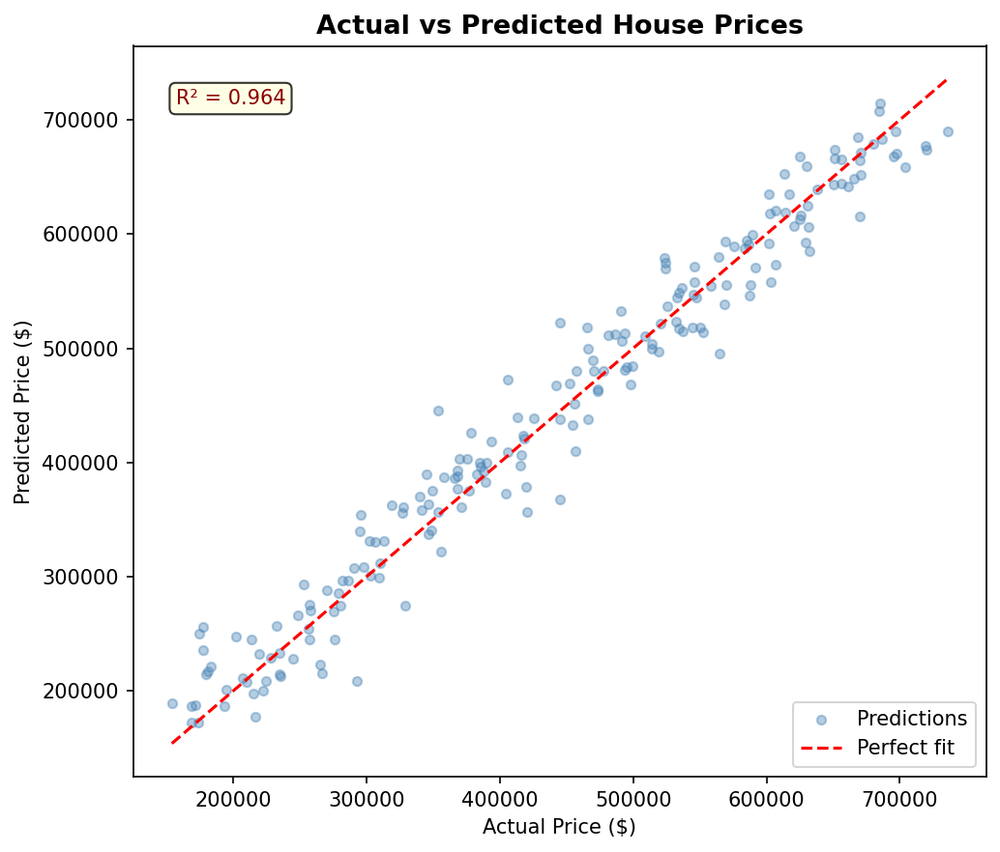
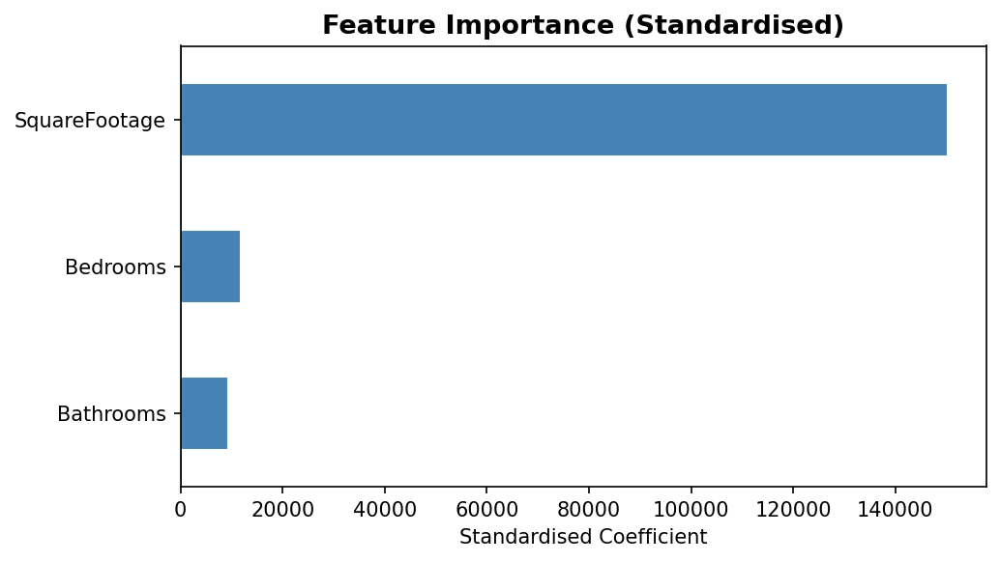
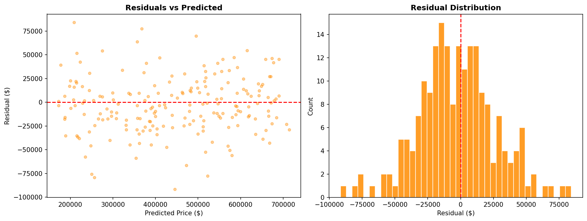

# House Price Prediction — Linear Regression

Predicts house sale prices using square footage, bedrooms, and bathrooms.

## Dataset
[Kaggle House Prices](https://www.kaggle.com/c/house-prices-advanced-regression-techniques/data)

## Tech Stack
Python | Scikit-learn | Pandas | Matplotlib | Seaborn

## Model Performance
- R² Score: 0.964
- MAE: ~$23,000  
- RMSE: ~$29,000

## Output Charts

